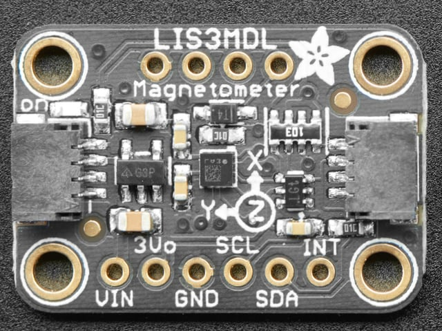
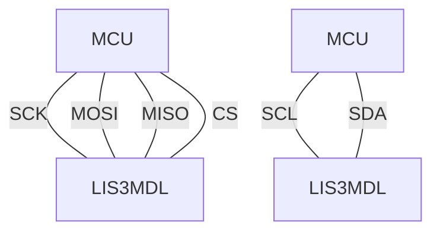
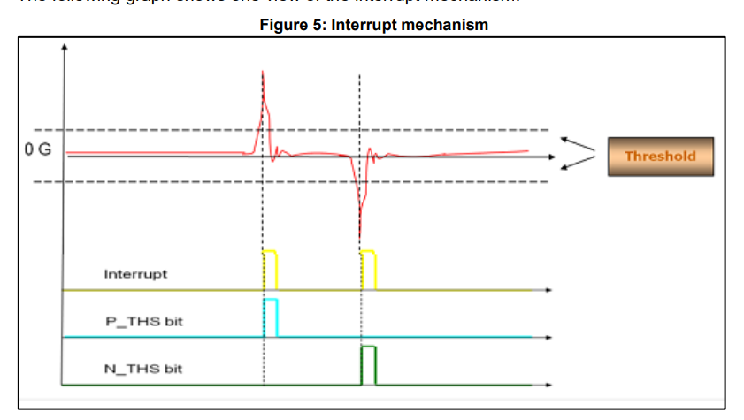

# Arduino-LIS3MDL
An Arduino / platformIO library for the [LIS3MDL](https://www.st.com/en/mems-and-sensors/lsm6dso32.html) 3-axis magnetometer.



*image credit: [Adafruit](https://learn.adafruit.com/lis3mdl-triple-axis-magnetometer)*

Developed by [Sam Scott](https://github.com/robosam2003)

# Namespace

The class and it's registers are scoped within the `LIS3MDL` namespace.

E.g `LIS3MDL::REGISTER::STATUS_REG`,  `LIS3MDL::OUTPUT_DATA_RATES::ODR_1000_HZ`

# Usage

- SPI constructor (recommended)
    
```cpp
#define LIS_CS 37
LIS3MDL::LIS3MDL LIS(LIS_CS, SPI, 4000000);
```
- I2C constructor
    
```cpp
LIS3MDL::LIS3MDL LIS(&Wire, 1000000);
```

Wiring guide:


It is recommended to call `LIS.default_configuration()` in your setup function.
Individual settings can then be changed as required. E.g.
    
```cpp
LIS.set_mag_ODR(LIS3MDL::OUTPUT_DATA_RATES::ODR_1000_HZ);
```


---

# Interrupts Graphic

